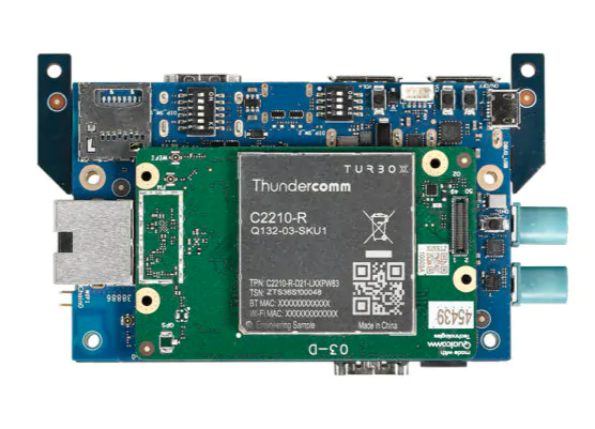
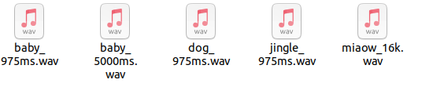
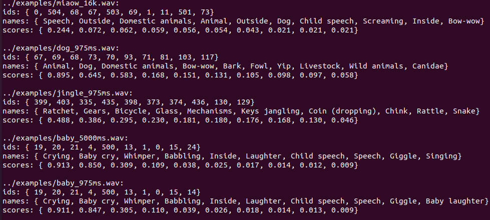

# Qualcomm® QRB2210 Open Kits AudioRecognition-demo Developer documentation

## Introduce

The project is based on the source code of the QRB2210 development kit system and runs on the QRB2210 development board, making full use of the diversification and powerful connection and computing capabilities of the development kit. tensorflow lite c++ library is used to load and process YAMNet tflite model files, and libsndfile library is used to read related information of audio files. After processing, the sequence number, name and probability of the top 10 possible probability labels of the audio are output.

**How does it work?**<br>
(1)Prepare the Audio to be analyzed and place it in the audios directory on the same level as the audio-recognition executable.<br>
(2) Place the trained yamnet model file (must be named yamnet.tflite) and the model label file (must be named yamnet_class_map.csv) in the cfg directory on the same level as the Audio-recognition executable.<br>
(3)Execute the DarkEnhance executable.<br>

Qualcomm® QRB2210 SoC Open Kits



## Materials and Tools used for the project

1. Hardware materials

Except for the Open Kits,The following hardware materials are also needed:

* Type-C usb line

using the usb line to develop on Qualcomm® QRB2210 SoC Open Kits.


* Charger

Direct power supply for Qualcomm® QRB2210 SoC Open Kits.


## Environment configuration

This section mainly describes the source and configuration of some open source projects or third-party tools needed in the development process.

### Tensorflow lite C++
TensorFlow Lite (TFLite) is a framework for running machine learning models on resource-constrained devices.<br>
url: https://www.tensorflow.org/

### libsndfile
libsndfile is an open source library for reading and writing audio files.<br>
https://github.com/libsndfile/libsndfile

## Compile
No special compilation method is required. After configuring the RB1 special SDK, the product can be generated directly by Cmake compilation.

## Configure and Usage
Start the RB1 and connection RB1 to host by Type-c usb.
### 1. Configure
(1)Prepare the Audio to be analyzed and place it in the audios directory on the same level as the audio-recognition executable.<br>
(2) Place the trained yamnet model file (must be named yamnet.tflite) and the model label file (must be named yamnet_class_map.csv) in the cfg directory on the same level as the Audio-recognition executable.<br>
(3)Execute the Audio-recognition executable.<br>

### 2. Usage
The executable files in the bin directory do not require additional command line parameters. The parameters used by the program are configured by the json file, so you only need to put the configuration file in the same directory to execute the program.<br>

```
adb push ./AudioRecognition /data/selfie
adb shell
cd data/selfie/AudioRecognition/build
./Audio-recognition
```


**result show**
[audio_list.png](./res/audio_list.png)&nbsp;&nbsp;&nbsp;&nbsp;&nbsp;&nbsp;[result_list.png](./res/result_list.png)&nbsp;&nbsp;&nbsp;&nbsp;&nbsp;&nbsp;
<div style="display:flex;justify-content:space-between;;margin-top:20px;">
  
</div>

<div style="display:flex;justify-content:space-between;margin-top:40px;">
  
</div>
